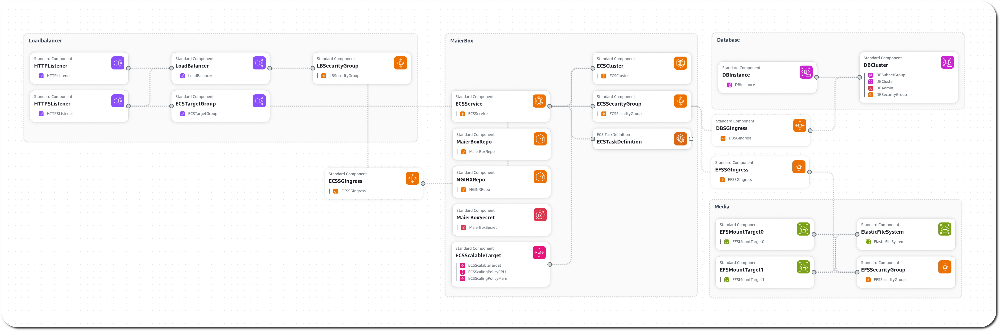

# MaierBox-cf

### Description
A collection of CloudFormation scripts designed for deploying [MaierBox](https://github.com/retrontology/MaierBox) to AWS via ECS.

## maierbox.yml
### Description
A CloudFormation template for deploying [MaierBox](https://github.com/retrontology/MaierBox) containers to an autoscaling ECS Service. An Application LoadBalancer is used to distribute traffic, an Aurora Serverless V2 cluster is used for the Database, and an Elastic FileSystem is mounted to the containers for flexible media storage.

## vpc.yml
### Description
A basic CloudFormation template for deploying a two AZ VPC with two private and two public subnets.
